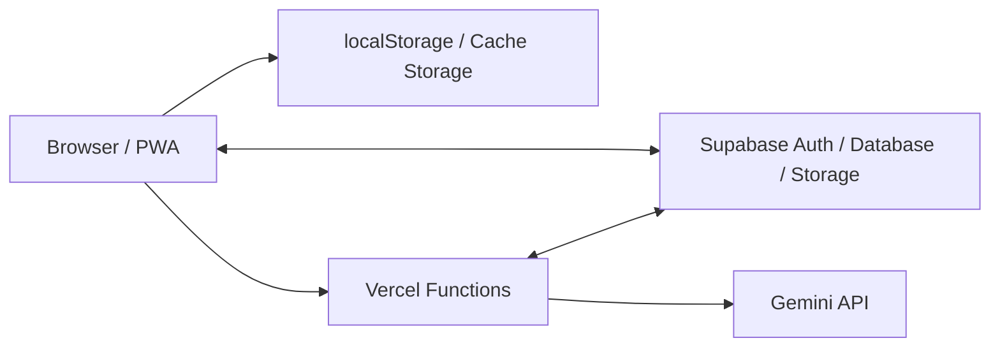

# My Planner

予定、タスク、メモ、学習内容を一か所で管理する個人開発のPWAです。
単に情報を保存するだけでなく、「今日何をするか」と「蓄積した知識をどう使うか」を
同じ操作の流れで扱えることを目指しています。

**Production:** [my-planner-five-alpha.vercel.app](https://my-planner-five-alpha.vercel.app)

## 主な機能

- **Home**: 今日の予定・優先タスク・習慣をまとめて確認
- **Calendar**: 月・週・日表示、繰り返し予定、端末間同期
- **Tasks**: 締め切り、重要度、サブタスク、作業時間を管理
- **Memo**: ブロック編集、Markdown入力、画像、表、数式、Undo / Redo
- **Knowledge**: 質問から構造化された解説を作成し、分野・時代・地域・概念で整理
- **Nuance Atlas**: 英語表現のニュアンス、語源、用例、関連表現を保存・比較
- **PWA / Offline**: Service Workerによるオフライン起動と静的ファイルキャッシュ

## この実装で重視したこと

### データを消さない同期

端末内のデータを先に保持し、Supabaseとの同期では更新時刻だけでなくフィールド単位の変更も考慮します。
通信途中に別端末で編集された場合や、取得件数が一時的に欠けた場合に、空の状態で既存データを
上書きしないよう保護しています。削除データはゴミ箱から復元できます。

### AI回答をそのまま保存しない

Geminiの回答はVercel Functionsで受け取り、用途ごとのJSON形式へ正規化・検証してから保存します。
長時間の生成はバックグラウンドジョブとして管理し、画面を移動しても状態を確認できます。
APIキーはブラウザへ配布しません。

### スマートフォンを中心にした操作

モバイル表示を基準にしながら、タブレットとPCでは情報量に合わせて表示幅を広げます。
カレンダーのタップ、メモのブロック操作、画像表示などはタッチ操作とキーボード操作の両方を考慮しています。

## Architecture



- **Frontend**: Vanilla JavaScript / ES Modules / CSS
- **Backend**: Vercel Functions、Supabase
- **Authentication & Sync**: Supabase Auth / Database / Realtime / RLS
- **AI**: Gemini API
- **Hosting**: Vercel
- **PWA**: Web App Manifest / Service Worker

## ディレクトリ構成

```text
my-planner/
├─ api/                 Vercel Functions（AI生成・ジョブ管理）
├─ css/                 共通・レスポンシブスタイル
├─ docs/                設計とコード読解資料
├─ js/
│  ├─ data/             学習用の組み込みデータ
│  ├─ modules/          画面ごとのモジュール
│  ├─ app.js            ルーティングと共通UI
│  ├─ storage.js        ローカルデータモデル
│  ├─ sync.js           Supabase同期
│  └─ ai.js             AIクライアント
├─ supabase/
│  ├─ schema.sql        新規環境用スキーマ
│  └─ migrations/       既存環境向けマイグレーション
├─ tests/               Node.js標準テスト
├─ index.html
├─ manifest.json
└─ sw.js
```

## 品質確認

保存・同期・AI回答形式・メモ編集・カレンダー操作・レスポンシブ表示を自動テストしています。

```bash
npm install
npm run build
npm test
```

`npm run build`ではJavaScript構文、関数コメント、ドキュメント内リンクを検査します。
`npm test`では外部APIをモックし、既存データを変更せずに主要処理を確認します。

## Local Development

```bash
npm install
npx serve .
```

Windowsでは`start.bat`でもローカルサーバーを起動できます。
AI機能とクラウド同期を利用するには、VercelとSupabase側の環境設定が必要です。

## Security

- Gemini APIキーはVercelの環境変数で管理し、フロントエンドへ送信しません。
- Supabaseのデータは`user_id`とRow Level Securityでユーザーごとに分離します。
- Service Role Keyや`.env`はリポジトリへ含めません。
- API・Supabaseの応答はService Workerでキャッシュしません。

## Documentation

コードを読む順番は[`docs/README.md`](docs/README.md)にまとめています。
特に、[`docs/architecture.md`](docs/architecture.md)、
[`docs/data-and-sync.md`](docs/data-and-sync.md)、
[`docs/ai-flow.md`](docs/ai-flow.md)から主要設計を確認できます。
